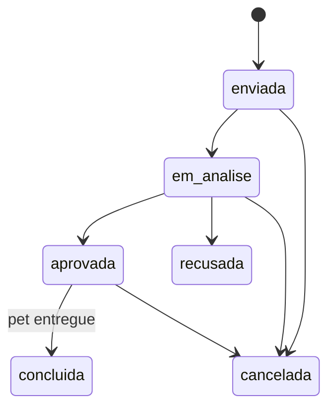

# Modelo de dados do PNA

Tudo aqui é criado pelo plugin `plugins/pna-core`. O tema só exibe.

## Pet (tipo de conteúdo `pet`)

Endereços: galeria em `/pets/`, cada pet em `/pets/nome-do-pet/`. No painel: menu **Pets**.

| Dado | Onde fica | Valores | Uso |
|---|---|---|---|
| Nome | Título | Texto | Card, página do pet |
| Descrição | Conteúdo | Texto | Página do pet |
| Foto principal | Imagem destacada | Imagem | Card, página do pet |
| Espécie | Taxonomia `pna_especie` | `cachorro`, `gato` | Filtro (`?especie=`) |
| Sexo | Taxonomia `pna_sexo` | `macho`, `femea` | Filtro (`?sexo=`), ícone do card |
| Porte | Taxonomia `pna_porte` | `pequeno`, `medio`, `grande` | Filtro (`?porte=`) |
| Idade | Taxonomia `pna_idade` | `filhote`, `jovem-adulto`, `adulto`, `desconhecida` | Filtro (`?idade=`) |
| Situação | Meta `_pna_status` | `disponivel`, `em_processo`, `adotado` | Galeria, fluxo de adoção |
| Castrado(a) | Meta `_pna_castrado` | `sem_info`, `sim`, `nao` | Página do pet ("Saúde") |
| Vacinas em dia | Meta `_pna_vacinado` | `sem_info`, `sim`, `nao` | Página do pet ("Saúde") |
| Sociável / Brincalhão / Carinhoso | Metas `_pna_sociavel`, `_pna_brincalhao`, `_pna_carinhoso` | `0` a `3` | Ícones de personalidade |
| Padrinhos | Calculado | Nº de apadrinhamentos ativos | "Padrinhos: 01" |

Regras:

- Características filtráveis são **taxonomias de escolha única**, escolhidas no quadro "Dados do pet". Os filtros funcionam pela URL: `/pets/?especie=gato&sexo=femea&porte=pequeno`.
- Os valores das características podem ser editados pela coordenação em **Pets → Espécies / Sexos / Portes / Faixas de idade**, mas os **slugs** acima não devem mudar: o tema usa `macho` e `femea` para escolher o ícone.
- A galeria mostra pets **disponíveis** e **em processo**. Pets **adotados** saem da galeria, mas continuam acessíveis pelo endereço.

## Solicitação (tipo de conteúdo `pna_solicitacao`)

Adoções e apadrinhamentos. Sempre **privadas**; criadas só pelos formulários do site (fase da área logada) ou pelo conteúdo de exemplo. No painel: menu **Solicitações**.

| Dado | Onde fica | Observação |
|---|---|---|
| Quem solicitou | Autor do post | Conta do Membro |
| Tipo | Meta `_pna_tipo` | `adocao` ou `apadrinhamento` |
| Pet | Meta `_pna_pet_id` | ID do pet |
| Status | Meta `_pna_status` | Ver fluxos abaixo |
| Respostas do formulário | Meta `_pna_dados` | Lista chave → valor (nome, telefone, CEP, motivo…) |
| Nota interna | Meta `_pna_nota_interna` | Só a equipe vê |
| Histórico | Meta `_pna_historico` | Cada mudança: status, quem e quando |

### Fluxo da adoção

Efeitos no pet (automáticos):

- **aprovada** → pet fica "Em processo de adoção".
- **concluida** → pet fica "Adotado" e os apadrinhamentos ativos dele são **encerrados**.
- **recusada** ou **cancelada** → pet volta a "Disponível", se não houver outra adoção aprovada.

### Fluxo do apadrinhamento

`enviada` → `em_analise` → `aprovada` (ativo) → `encerrada`. Também pode ir para `recusada` ou `cancelada`. Um apadrinhamento ativo é encerrado automaticamente quando o pet é adotado.

### Quem muda o status

| Mudança | Avaliador PNA | Gestor PNA / Administrador |
|---|---|---|
| Enviada → Em análise | ✅ | ✅ |
| Aprovar, recusar, concluir, encerrar | ❌ | ✅ |
| Cancelar | ✅ | ✅ |

Toda mudança passa pela função `pna_core_alterar_status_solicitacao()`, que valida a permissão, grava o histórico, atualiza o pet e dispara a ação `pna_core_solicitacao_status_alterado` (usada pelas notificações e e-mails, em fase futura).

### Contadores

- **Menu "Solicitações" no painel:** a bolinha vermelha mostra só as solicitações com status **Enviada** (novas, que ninguém da equipe olhou). Some quando todas foram movidas para outro status.
- **"Contagem de adoções" no site:** adoções **concluídas** (pet entregue). "Hoje" conta as concluídas na data atual, pelo histórico de cada solicitação.
- **"Padrinhos" na página do pet:** apadrinhamentos com status **Ativo (aprovado)**.

## Papéis

| Papel | Slug | Acesso |
|---|---|---|
| Membro | `pna_membro` | Área logada do site. Sem painel e sem barra de administração. Papel padrão de novos cadastros |
| Avaliador PNA | `pna_avaliador` | Painel: só Solicitações (ver, anotar, marcar "Em análise", cancelar) |
| Gestor PNA | `pna_gestor` | Painel: Pets, características e Solicitações com todas as decisões |
| Editor (WordPress) | `editor` | Conteúdo do site + Pets |
| Administrador (WordPress) | `administrator` | Tudo |

Ao alterar permissões em `includes/papeis.php`, aumente `PNA_CORE_VERSAO_PAPEIS` em `pna-core.php`: as permissões são reaplicadas no próximo acesso ao painel.

## Ganchos para o tema e fases futuras

| Gancho | Tipo | Quando |
|---|---|---|
| `pna_core_solicitacao_criada` | Ação | Solicitação criada |
| `pna_core_solicitacao_status_alterado` | Ação | Status de solicitação mudou |
| `pna_core_pet_status_alterado` | Ação | Situação do pet mudou |
| `pna_notificacoes_nao_lidas` | Filtro (do tema) | A preencher na fase de notificações |
| `pna_breadcrumb_itens` | Filtro (do tema) | A preencher nas páginas de formulário |
